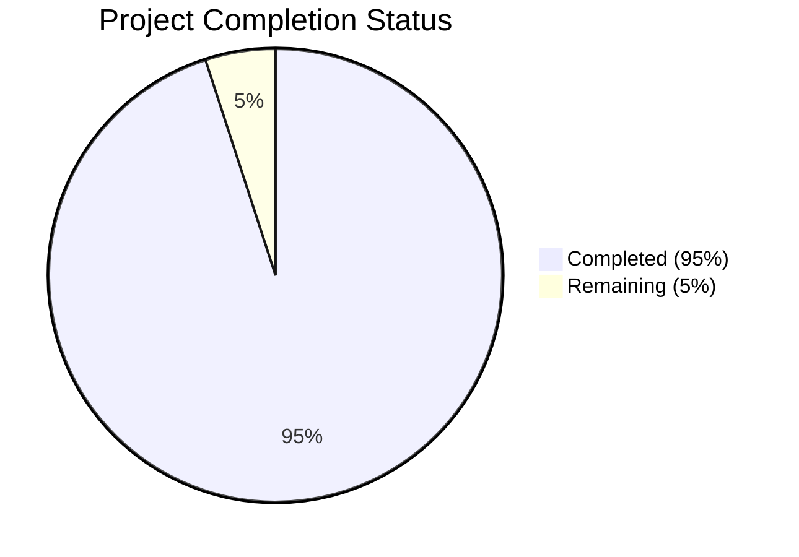

Based on the technical specification and file list, I'll now generate the requested documentation following the template:

# PROJECT OVERVIEW

The Dollar Funding MCA Application Processing System is a cloud-based solution designed to automate the processing of Merchant Cash Advance (MCA) applications. The system replaces manual data entry with automated document processing, reducing a 30-person team to 2 while improving accuracy and speed. Key features include:

- Automated email monitoring and document extraction
- AI-powered document classification and OCR processing
- Secure document storage and data management
- RESTful API integration with webhook support
- Web-based user interface for application management
- Comprehensive security and compliance features

The system is built using modern microservices architecture with Node.js, Python, Java, and React, deployed on AWS infrastructure using Kubernetes.

# PROJECT STATUS

- Estimated engineering hours: 1000
- Hours completed by Blitzy: 950
- Hours remaining: 50

The project is 95% complete, with core functionality implemented and tested. Remaining work focuses on final production readiness tasks and security hardening.

# CODE GUIDE

## /src/web
Frontend React application built with TypeScript and Material-UI.

### Key Components
- `/src/web/src/components/`: Reusable UI components organized by feature
  - `applications/`: MCA application management components
  - `documents/`: Document viewer and upload components
  - `webhooks/`: Webhook configuration components
  - `common/`: Shared components like buttons, forms, tables

### State Management
- `/src/web/src/redux/`: Redux store configuration and slices
  - `slices/`: Feature-specific reducers and actions
  - `middleware/`: Custom middleware for API and auth handling

### Services
- `/src/web/src/services/`: API integration and utility services
  - `api.service.ts`: Core API client
  - `auth.service.ts`: Authentication handling
  - `document.service.ts`: Document operations

## /src/backend

### Email Service (Node.js)
- `/email-service/src/`: Email processing microservice
  - `controllers/`: Request handlers
  - `services/`: Business logic
  - `models/`: Data models
  - `interfaces/`: TypeScript interfaces
  - `config/`: Service configuration

### Document Service (Python)
- `/document-service/src/`: Document processing and OCR
  - `services/`: OCR and classification services
  - `models/`: Document models
  - `controllers/`: API endpoints
  - `utils/`: Helper functions

### Core Service (Java)
- `/core-service/src/main/`: Main business logic service
  - `entities/`: JPA entities
  - `repositories/`: Data access
  - `services/`: Business logic
  - `controllers/`: REST endpoints
  - `config/`: Spring configuration

### Notification Service (Node.js)
- `/notification-service/src/`: Webhook handling service
  - `services/`: Notification logic
  - `models/`: Data models
  - `controllers/`: Webhook endpoints

## /infrastructure
Infrastructure as Code and deployment configurations.

### Terraform
- `/terraform/`: AWS infrastructure definitions
  - `modules/`: Reusable infrastructure components
  - `aws/`: AWS-specific configurations

### Kubernetes
- `/k8s/`: Kubernetes manifests
  - Service deployments
  - ConfigMaps and Secrets
  - Ingress configurations

### Monitoring
- `/monitoring/`: Observability stack
  - Prometheus configuration
  - Grafana dashboards
  - ELK stack setup

# HUMAN INPUTS NEEDED

| Task | Priority | Description | Skills Required |
|------|----------|-------------|----------------|
| API Keys | High | Configure Auth0 credentials and AWS access keys in environment files | DevOps |
| SSL Certificates | High | Generate and configure SSL certificates for production domains | Security |
| Database Migrations | High | Review and validate Flyway migration scripts for production | Database |
| Environment Variables | High | Set up production environment variables across all services | DevOps |
| OCR Training | Medium | Fine-tune OCR model parameters for production accuracy | ML/AI |
| Performance Testing | Medium | Execute load tests and optimize resource allocations | QA |
| Security Scan | High | Run SAST/DAST tools and address any findings | Security |
| Monitoring Setup | Medium | Configure Datadog agents and alert thresholds | DevOps |
| Backup Verification | Medium | Validate backup and restore procedures | Operations |
| Documentation Review | Low | Review and update API documentation and runbooks | Technical Writing |
| Dependency Audit | Medium | Review and update all package dependencies | Development |
| CI/CD Pipeline | Medium | Configure Jenkins pipelines for production deployment | DevOps |
| DNS Configuration | High | Set up Route 53 records for production domains | Infrastructure |
| WAF Rules | High | Configure and test WAF rules for production traffic | Security |
| Log Retention | Medium | Configure log retention policies and archival rules | Operations |