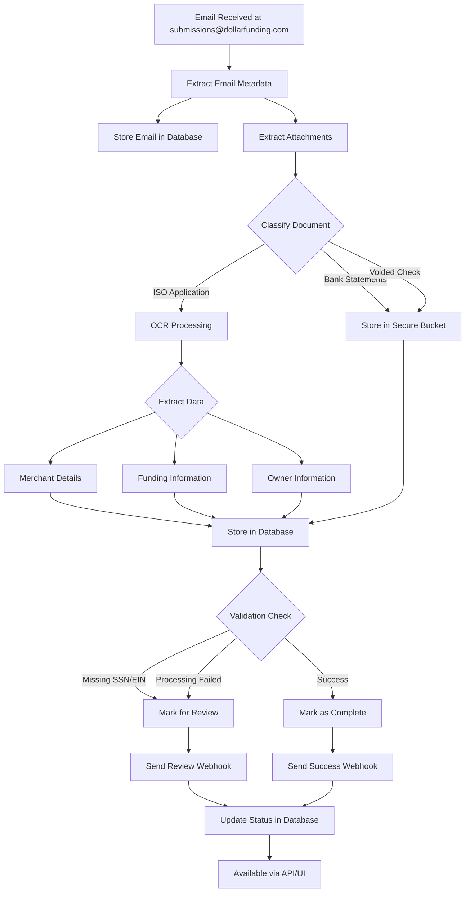
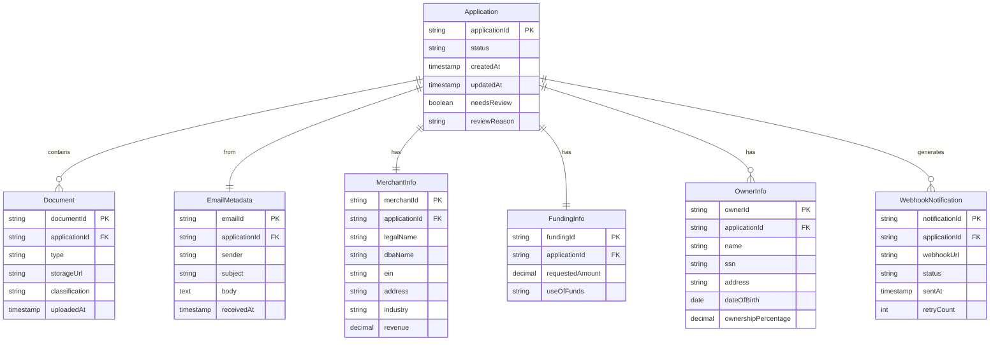
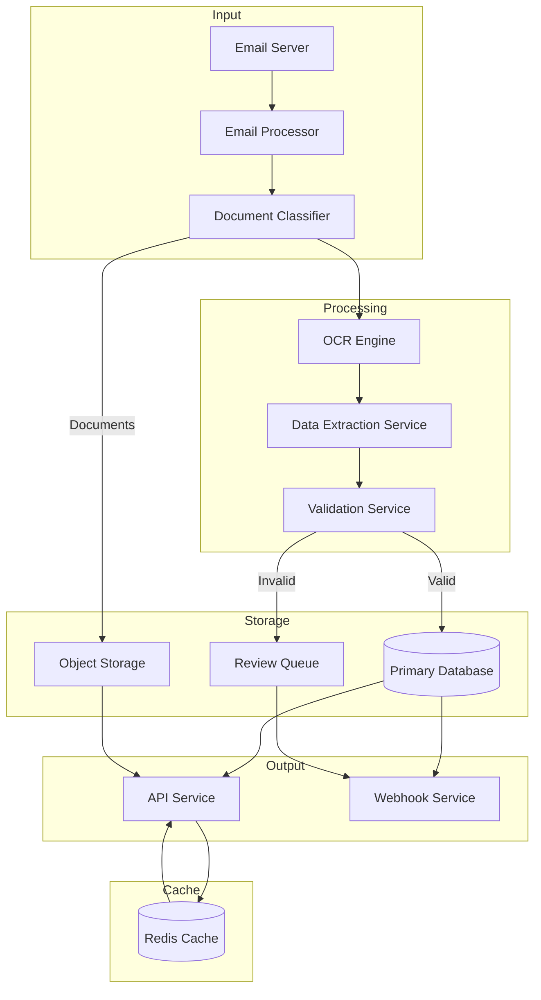
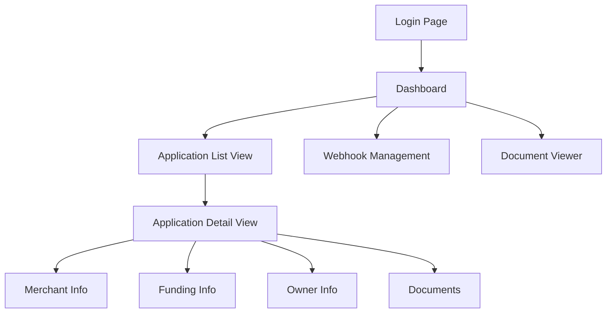

# 1. INTRODUCTION

## 1.1 Purpose

This Software Requirements Specification (SRS) document provides a comprehensive description of the Dollar Funding MCA Application Processing System. It details the functional and non-functional requirements for the development team, project stakeholders, and system architects. The document serves as the primary reference for technical and non-technical audiences to understand the expected behavior, constraints, and specifications of the system.

## 1.2 Scope

The Dollar Funding MCA Application Processing System is a cloud-based solution designed to automate the processing of Merchant Cash Advance applications. The system will:

- Process incoming emails from brokers at submissions@dollarfunding.com
- Extract and store email metadata and attachments
- Classify different types of documents (ISO applications, bank statements, voided checks)
- Perform advanced OCR on ISO applications to extract:
  - Merchant details (Business name, DBA, EIN, address, industry, revenue)
  - Funding information (Amount requested, use of funds)
  - Owner information (Name, SSN, DOB, address, ownership percentage)
- Store processed data in secure databases
- Notify clients through webhooks about application status
- Provide both API and UI interfaces for:
  - Webhook management
  - Application data retrieval
  - Document viewing
  - Application status monitoring

The system aims to replace 93% of manual data entry operations, reducing the data entry team from 30 to 2 personnel while maintaining accuracy and improving processing speed. The solution will be built with enterprise-grade reliability, featuring high availability, scalability, and robust security measures to handle sensitive financial and personal information.

# 2. PRODUCT DESCRIPTION

## 2.1 Product Perspective

The Dollar Funding MCA Application Processing System operates as a standalone cloud-based service that integrates with Dollar Funding's existing email infrastructure and business processes. The system interfaces with:

- Email servers (receiving submissions@dollarfunding.com)
- Cloud storage services for document management
- Secure databases for application data
- Client systems via REST APIs and webhooks
- Web browsers for UI access

The system architecture follows a microservices pattern with these key components:

- Email Processing Service
- Document Classification Service
- OCR Processing Engine
- Data Extraction Service
- Webhook Notification Service
- API Gateway
- Web Interface

## 2.2 Product Functions

The primary functions of the system include:

1. Email Processing
   - Monitor submissions@dollarfunding.com
   - Extract and store email metadata
   - Download and validate attachments

2. Document Management
   - Classify incoming documents
   - Store documents securely
   - Provide controlled access to stored documents

3. Data Extraction
   - Perform OCR on ISO applications
   - Extract merchant information
   - Extract funding details
   - Extract owner information
   - Handle imperfect documents and handwriting

4. Notification System
   - Send webhook notifications for processed applications
   - Alert for applications requiring review
   - Manage webhook configurations

5. Data Access
   - Provide REST API endpoints
   - Present web-based user interface
   - Enable document viewing
   - Support webhook management

## 2.3 User Characteristics

The system serves three primary user types:

1. API Integration Users
   - Technical expertise: High
   - Primary interaction: REST APIs
   - Needs: Integration documentation, API keys, webhook management

2. Operations Staff
   - Technical expertise: Medium
   - Primary interaction: Web UI
   - Needs: Application monitoring, document review, status updates

3. System Administrators
   - Technical expertise: High
   - Primary interaction: Both API and UI
   - Needs: System configuration, webhook management, access control

## 2.4 Constraints

1. Technical Constraints
   - Must process emails from submissions@dollarfunding.com exclusively
   - Must maintain 99.9% uptime
   - Must handle varying document quality and formats
   - Must support concurrent processing of multiple applications

2. Security Constraints
   - Must comply with financial data security regulations
   - Must encrypt sensitive data (SSN, EIN) at rest and in transit
   - Must implement role-based access control
   - Must maintain audit logs of all system access

3. Operational Constraints
   - Must process applications within 5 minutes of receipt
   - Must achieve 93% automation rate
   - Must maintain accuracy equal to or better than manual processing

4. Regulatory Constraints
   - Must comply with data privacy regulations
   - Must maintain records for audit purposes
   - Must implement data retention policies

## 2.5 Assumptions and Dependencies

Assumptions:
1. Email server will remain accessible and operational
2. Document formats will remain consistent with current standards
3. Volume will not exceed 1000 applications per day
4. Network connectivity will be reliable and sufficient

Dependencies:
1. Email service provider availability
2. Cloud infrastructure services
3. OCR processing engine performance
4. Client system availability for webhook delivery
5. Third-party security certificate providers
6. Database management system reliability

## 2.6 Process Flowchart

# 3. FUNCTIONAL REQUIREMENTS

## 3.1 Email Processing Features

### F1: Email Monitoring and Extraction
**Priority: Critical**

| ID | Requirement Description |
|----|------------------------|
| F1.1 | System shall continuously monitor submissions@dollarfunding.com for new emails |
| F1.2 | System shall extract email metadata including sender, subject, timestamp, and body |
| F1.3 | System shall validate email format and presence of attachments |
| F1.4 | System shall store email metadata in the database with a unique identifier |
| F1.5 | System shall handle email server connection interruptions with automatic retry mechanism |

### F2: Attachment Processing
**Priority: Critical**

| ID | Requirement Description |
|----|------------------------|
| F2.1 | System shall extract all PDF attachments from incoming emails |
| F2.2 | System shall validate PDF format and readability |
| F2.3 | System shall generate unique identifiers for each attachment |
| F2.4 | System shall store attachments in secure cloud storage |
| F2.5 | System shall maintain relationship between emails and their attachments |

## 3.2 Document Management Features

### F3: Document Classification
**Priority: High**

| ID | Requirement Description |
|----|------------------------|
| F3.1 | System shall classify documents into ISO applications, bank statements, and voided checks |
| F3.2 | System shall achieve 95% accuracy in document classification |
| F3.3 | System shall flag unclassifiable documents for manual review |
| F3.4 | System shall store document classification results in the database |
| F3.5 | System shall handle multiple documents of the same type in a single application |

## 3.3 Data Extraction Features

### F4: OCR Processing
**Priority: Critical**

| ID | Requirement Description |
|----|------------------------|
| F4.1 | System shall perform OCR on ISO applications with 98% accuracy |
| F4.2 | System shall handle handwritten text on applications |
| F4.3 | System shall process imperfectly scanned documents |
| F4.4 | System shall identify and correct common OCR errors |
| F4.5 | System shall maintain original document image quality |

### F5: Merchant Information Extraction
**Priority: Critical**

| ID | Requirement Description |
|----|------------------------|
| F5.1 | System shall extract business legal name, DBA name, and EIN |
| F5.2 | System shall extract business address and industry information |
| F5.3 | System shall extract revenue information |
| F5.4 | System shall validate extracted data against expected formats |
| F5.5 | System shall flag missing or invalid merchant information |

### F6: Funding Information Extraction
**Priority: High**

| ID | Requirement Description |
|----|------------------------|
| F6.1 | System shall extract requested funding amount |
| F6.2 | System shall extract use of funds information |
| F6.3 | System shall validate funding amount format |
| F6.4 | System shall flag missing funding information |
| F6.5 | System shall store funding details in the database |

### F7: Owner Information Extraction
**Priority: Critical**

| ID | Requirement Description |
|----|------------------------|
| F7.1 | System shall extract owner names, SSNs, and DOBs |
| F7.2 | System shall extract owner addresses |
| F7.3 | System shall extract ownership percentages |
| F7.4 | System shall support multiple owners per application |
| F7.5 | System shall flag missing or invalid SSNs for review |

## 3.4 Notification Features

### F8: Webhook Management
**Priority: High**

| ID | Requirement Description |
|----|------------------------|
| F8.1 | System shall support webhook registration and management |
| F8.2 | System shall validate webhook URLs |
| F8.3 | System shall support webhook retry logic |
| F8.4 | System shall maintain webhook delivery logs |
| F8.5 | System shall support multiple webhooks per client |

### F9: Status Notifications
**Priority: High**

| ID | Requirement Description |
|----|------------------------|
| F9.1 | System shall send notifications for completed application processing |
| F9.2 | System shall send notifications for applications requiring review |
| F9.3 | System shall include relevant application data in notifications |
| F9.4 | System shall track notification delivery status |
| F9.5 | System shall support notification customization |

## 3.5 Interface Features

### F10: API Interface
**Priority: Critical**

| ID | Requirement Description |
|----|------------------------|
| F10.1 | System shall provide RESTful API endpoints for all operations |
| F10.2 | System shall implement secure API authentication |
| F10.3 | System shall support API rate limiting |
| F10.4 | System shall provide API documentation |
| F10.5 | System shall version API endpoints |

### F11: Web Interface
**Priority: High**

| ID | Requirement Description |
|----|------------------------|
| F11.1 | System shall provide web-based application viewing |
| F11.2 | System shall support document preview |
| F11.3 | System shall provide webhook configuration interface |
| F11.4 | System shall display application processing status |
| F11.5 | System shall support user authentication and authorization |

# 4. NON-FUNCTIONAL REQUIREMENTS

## 4.1 Performance Requirements

| ID | Requirement Description | Target Metric |
|----|------------------------|---------------|
| P1 | Email processing latency | < 30 seconds from receipt |
| P2 | Document classification time | < 15 seconds per document |
| P3 | OCR processing time | < 60 seconds per application |
| P4 | API response time | < 200ms for 95th percentile |
| P5 | Webhook notification delivery | < 5 seconds |
| P6 | Concurrent application processing | Minimum 100 simultaneous |
| P7 | Database query response time | < 100ms for 95th percentile |
| P8 | Document storage retrieval time | < 3 seconds for any file |
| P9 | System resource utilization | < 80% CPU, < 85% memory |
| P10 | Batch processing capability | 1000 applications per day |

## 4.2 Safety Requirements

| ID | Requirement Description |
|----|------------------------|
| S1 | System shall maintain complete audit trails of all operations |
| S2 | System shall implement automatic data backup every 6 hours |
| S3 | System shall provide disaster recovery with RPO < 1 hour |
| S4 | System shall implement automatic failover for critical components |
| S5 | System shall maintain data integrity during partial system failures |
| S6 | System shall prevent data loss during network interruptions |
| S7 | System shall implement circuit breakers for external service calls |
| S8 | System shall maintain separate staging and production environments |

## 4.3 Security Requirements

| ID | Requirement Description |
|----|------------------------|
| SE1 | Implement AES-256 encryption for data at rest |
| SE2 | Use TLS 1.3 for all data in transit |
| SE3 | Implement JWT-based authentication for API access |
| SE4 | Enforce role-based access control (RBAC) |
| SE5 | Store sensitive data (SSN, EIN) using field-level encryption |
| SE6 | Implement API rate limiting and DDoS protection |
| SE7 | Maintain security audit logs for 1 year |
| SE8 | Enforce strong password policies for UI access |
| SE9 | Implement IP whitelisting for API access |
| SE10 | Perform regular security vulnerability scans |

## 4.4 Quality Requirements

### 4.4.1 Availability
- System uptime: 99.9% excluding planned maintenance
- Maximum planned downtime: 4 hours per month
- Automatic failover time: < 30 seconds

### 4.4.2 Maintainability
- Modular architecture with microservices
- Comprehensive API documentation
- Automated deployment pipelines
- Code coverage minimum 80%
- Automated testing for all critical paths

### 4.4.3 Usability
- Web interface response time < 2 seconds
- Mobile-responsive design
- Intuitive navigation structure
- Clear error messages and notifications
- Support for modern browsers (Chrome, Firefox, Safari, Edge)

### 4.4.4 Scalability
- Horizontal scaling capability for all services
- Auto-scaling based on load metrics
- Support for 200% growth in transaction volume
- Database sharding capability
- Load balancing across multiple availability zones

### 4.4.5 Reliability
- Mean Time Between Failures (MTBF): > 720 hours
- Mean Time To Recovery (MTTR): < 30 minutes
- Error rate: < 0.1% of all transactions
- Data durability: 99.999999999%
- Automated system health monitoring

## 4.5 Compliance Requirements

| ID | Requirement Description |
|----|------------------------|
| C1 | Comply with SOC 2 Type II requirements |
| C2 | Maintain PCI DSS compliance for payment data |
| C3 | Implement GDPR compliance for personal data |
| C4 | Follow NIST guidelines for encryption standards |
| C5 | Maintain audit trails for 7 years |
| C6 | Implement data retention policies |
| C7 | Support data subject access requests |
| C8 | Provide data breach notification mechanisms |
| C9 | Maintain compliance with state privacy laws |
| C10 | Regular compliance audit documentation |

# 5. DATA REQUIREMENTS

## 5.1 Data Models

## 5.2 Data Storage

### 5.2.1 Database Requirements
- Primary database: Distributed PostgreSQL cluster
- Document storage: S3-compatible object storage
- Cache layer: Redis cluster for high-performance data access

### 5.2.2 Data Retention
- Application data: 7 years active retention
- Email metadata: 7 years
- Documents: 7 years with versioning
- Webhook logs: 1 year
- Audit trails: 7 years
- System logs: 90 days

### 5.2.3 Backup and Recovery
- Full database backup: Daily
- Incremental backups: Every 6 hours
- Point-in-time recovery capability: 30 days
- Cross-region backup replication
- Recovery Time Objective (RTO): 1 hour
- Recovery Point Objective (RPO): 15 minutes

### 5.2.4 Data Redundancy
- Database: Multi-AZ deployment with synchronous replication
- Object storage: Cross-region replication with 99.999999999% durability
- Cache layer: Multi-node cluster with automatic failover

## 5.3 Data Processing

### 5.3.1 Data Security
- Encryption at rest using AES-256
- TLS 1.3 for data in transit
- Field-level encryption for SSN and EIN
- Data masking for sensitive information in logs
- Access control through IAM policies
- Regular key rotation
- Audit logging of all data access

### 5.3.2 Data Flow

### 5.3.3 Data Validation Rules
- EIN: 9-digit format validation
- SSN: 9-digit format with pattern matching
- Email: RFC 5322 standard compliance
- Phone numbers: E.164 format
- Currency amounts: 2 decimal place precision
- Dates: ISO 8601 format
- Ownership percentage: Sum must equal 100%

### 5.3.4 Data Archival
- Automated archival after 2 years of inactivity
- Compressed storage for archived data
- Separate archive storage tier
- Indexed for compliance searches
- Automated restoration capability

# 6. EXTERNAL INTERFACES

## 6.1 User Interfaces

### 6.1.1 Web Application Interface

| Screen | Key Requirements |
|--------|-----------------|
| Dashboard | - Real-time application processing statistics - Status overview cards - Quick action buttons - Recent activity feed |
| Application List | - Sortable/filterable table view - Status indicators - Search functionality - Pagination controls |
| Application Detail | - Tabbed interface for different data sections - Side-by-side document preview - Edit capability for review items - Status change controls |
| Webhook Management | - Webhook URL configuration - Event type selection - Test webhook functionality - Delivery logs |
| Document Viewer | - PDF rendering - Zoom controls - Download option - Multi-page navigation |

### 6.1.2 Mobile Responsiveness Requirements

| Element | Requirement |
|---------|-------------|
| Layout | Fluid grid system adapting to screen sizes |
| Navigation | Collapsible menu for mobile devices |
| Tables | Horizontal scrolling on small screens |
| Documents | Optimized viewer for mobile devices |
| Forms | Touch-friendly input controls |

## 6.2 Software Interfaces

### 6.2.1 Email Service Interface

| Component | Specification |
|-----------|--------------|
| Protocol | IMAP/SMTP |
| Authentication | OAuth 2.0 |
| Polling Interval | 30 seconds |
| Error Handling | Automatic retry with exponential backoff |
| Security | TLS 1.3 |

### 6.2.2 Storage Service Interface

| Component | Specification |
|-----------|--------------|
| Protocol | S3 API |
| Authentication | IAM roles |
| Encryption | Server-side AES-256 |
| Access Pattern | Presigned URLs for temporary access |
| Versioning | Enabled with 30-day retention |

### 6.2.3 OCR Engine Interface

| Component | Specification |
|-----------|--------------|
| Integration | REST API |
| Input Format | PDF, JPEG, PNG |
| Output Format | JSON |
| Authentication | API key |
| Rate Limiting | 100 requests/minute |

### 6.2.4 Database Interface

| Component | Specification |
|-----------|--------------|
| Type | PostgreSQL |
| Version | 14.x or higher |
| Connection Pool | 50-200 connections |
| SSL Mode | Verify-full |
| Query Timeout | 30 seconds |

## 6.3 Communication Interfaces

### 6.3.1 API Interface Specifications

| Endpoint Type | Protocol | Format | Authentication |
|---------------|----------|---------|----------------|
| REST API | HTTPS | JSON | JWT Bearer Token |
| Webhooks | HTTPS | JSON | HMAC Signature |
| WebSocket | WSS | JSON | JWT Bearer Token |

### 6.3.2 API Rate Limiting

| Client Type | Rate Limit | Burst Limit |
|-------------|------------|-------------|
| Standard | 1000 requests/hour | 50 requests/minute |
| Premium | 5000 requests/hour | 200 requests/minute |
| Internal | Unlimited | N/A |

### 6.3.3 Webhook Delivery Specifications

| Component | Specification |
|-----------|--------------|
| Protocol | HTTPS POST |
| Retry Strategy | 3 attempts with exponential backoff |
| Timeout | 10 seconds |
| Payload Size | Maximum 1MB |
| Security | HMAC SHA-256 signature |

### 6.3.4 Network Requirements

| Requirement | Specification |
|-------------|--------------|
| Bandwidth | Minimum 100 Mbps |
| Latency | Maximum 100ms |
| DNS | Route 53 with health checks |
| CDN | CloudFront for static assets |
| Load Balancer | Application Load Balancer |

# APPENDICES

## A.1 GLOSSARY

| Term | Definition |
|------|------------|
| Merchant Cash Advance (MCA) | A type of business financing where a company sells its future receivables at a discount for immediate capital |
| ISO Application | Independent Sales Organization application form used to collect merchant and funding details |
| Webhook | A method of augmenting or altering the behavior of a web application with custom callbacks |
| Document Classification | The process of categorizing documents into predefined types based on their content |
| Field-level Encryption | Encryption of specific data fields while leaving other fields unencrypted |
| Data Masking | The process of hiding original data with modified content while maintaining data usability |
| Presigned URL | A URL that provides temporary access to private objects in cloud storage |

## A.2 ACRONYMS

| Acronym | Expansion |
|---------|-----------|
| MCA | Merchant Cash Advance |
| ISO | Independent Sales Organization |
| DBA | Doing Business As |
| EIN | Employer Identification Number |
| SSN | Social Security Number |
| DOB | Date of Birth |
| OCR | Optical Character Recognition |
| API | Application Programming Interface |
| UI | User Interface |
| JWT | JSON Web Token |
| HMAC | Hash-based Message Authentication Code |
| RPO | Recovery Point Objective |
| RTO | Recovery Time Objective |
| MTBF | Mean Time Between Failures |
| MTTR | Mean Time To Recovery |
| IAM | Identity and Access Management |
| CDN | Content Delivery Network |

## A.3 ADDITIONAL REFERENCES

| Reference | Description | URL/Location |
|-----------|-------------|--------------|
| RFC 5322 | Internet Message Format | https://tools.ietf.org/html/rfc5322 |
| E.164 | International Public Telecommunication Numbering Plan | https://www.itu.int/rec/T-REC-E.164 |
| ISO 8601 | Date and Time Format | https://www.iso.org/iso-8601-date-and-time-format.html |
| NIST SP 800-53 | Security and Privacy Controls | https://nvlpubs.nist.gov/nistpubs/SpecialPublications/NIST.SP.800-53r5.pdf |
| SOC 2 | Service Organization Control 2 | https://www.aicpa.org/soc2 |
| PCI DSS | Payment Card Industry Data Security Standard | https://www.pcisecuritystandards.org |
| GDPR | General Data Protection Regulation | https://gdpr.eu |