# 1. EXECUTIVE SUMMARY

The Dollar Funding MCA Application Processing System is a cloud-based solution designed to automate the processing of Merchant Cash Advance (MCA) applications. Currently, Dollar Funding employs a 30-person data entry team to manually process applications received via email from brokers. This system will automate 93% of these operations, reducing the team to 2 personnel while improving accuracy and processing speed.

The solution addresses the critical business need for efficient, accurate, and scalable processing of MCA applications by implementing state-of-the-art OCR technology, intelligent document classification, and automated data extraction. The system will serve brokers, Dollar Funding's operations team, and system administrators through both API and UI interfaces, delivering significant operational cost savings and improved application processing throughput.

# 2. SYSTEM OVERVIEW

## Project Context

| Aspect | Description |
|--------|-------------|
| Business Context | Dollar Funding operates in the competitive MCA market where processing speed and accuracy directly impact revenue and customer satisfaction |
| Current Limitations | Manual data entry is slow, error-prone, and scales linearly with headcount |
| Enterprise Integration | System will integrate with existing email infrastructure while introducing new automated processing capabilities |

## High-Level Description

| Component | Description |
|-----------|-------------|
| Email Processing | Automated monitoring and processing of submissions@dollarfunding.com |
| Document Management | AI-powered classification and secure storage of application documents |
| Data Extraction | Advanced OCR with support for handwritten text and imperfect scans |
| Integration Layer | REST APIs and webhooks for system integration |
| User Interface | Web-based interface for application management and monitoring |

## Success Criteria

| Metric | Target |
|--------|---------|
| Automation Rate | 93% of applications processed without human intervention |
| Processing Time | < 5 minutes per application |
| Accuracy | ≥ 99% accuracy in data extraction |
| Cost Reduction | 93% reduction in data entry staff (from 30 to 2) |
| System Availability | 99.9% uptime |

# 3. SCOPE

## In-Scope Elements

### Core Features and Functionalities

| Category | Features |
|----------|-----------|
| Email Processing | - Email monitoring and extraction<br>- Attachment handling<br>- Metadata storage |
| Document Processing | - Document classification<br>- OCR processing<br>- Data extraction |
| Data Management | - Merchant information<br>- Funding details<br>- Owner information |
| Integration | - REST APIs<br>- Webhook notifications<br>- Status updates |
| User Interface | - Application viewing<br>- Document management<br>- Webhook configuration |

### Implementation Boundaries

| Boundary Type | Coverage |
|--------------|----------|
| System Access | Cloud-based access via web browsers and APIs |
| User Groups | - API integration users<br>- Operations staff<br>- System administrators |
| Geographic Coverage | United States market |
| Data Domains | - MCA applications<br>- Bank statements<br>- Business documentation |

## Out-of-Scope Elements

| Category | Excluded Elements |
|----------|------------------|
| Features | - Application underwriting<br>- Payment processing<br>- Customer relationship management |
| Integrations | - Legacy system migrations<br>- Third-party CRM systems<br>- Accounting software integration |
| Use Cases | - Mobile application development<br>- Broker portal functionality<br>- Direct customer applications |
| Future Phases | - Machine learning for application decisioning<br>- Automated underwriting<br>- Multi-language support |

# 4. SYSTEM ARCHITECTURE

## 4.1 High-Level Architecture

```mermaid
C4Context
    title System Context (Level 0)

    Person(broker, "Broker", "Submits MCA applications")
    Person(staff, "Operations Staff", "Reviews applications")
    Person(admin, "System Admin", "Manages system")

    System_Boundary(sys, "MCA Processing System") {
        System(email, "Email Processing")
        System(doc, "Document Processing")
        System(data, "Data Management")
        System(api, "API Gateway")
        System(ui, "Web Interface")
    }

    System_Ext(email_server, "Email Server")
    System_Ext(storage, "Cloud Storage")
    System_Ext(client_sys, "Client Systems")

    Rel(broker, email_server, "Sends applications", "SMTP")
    Rel(email_server, sys, "Forwards emails", "IMAP")
    Rel(sys, storage, "Stores documents", "S3 API")
    Rel(sys, client_sys, "Notifies", "Webhooks")
    Rel(staff, sys, "Accesses", "HTTPS")
    Rel(admin, sys, "Manages", "HTTPS")
```

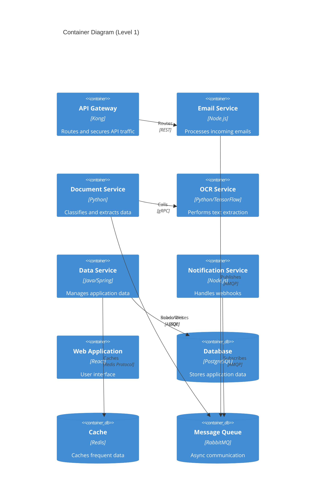

## 4.2 Component Details

### 4.2.1 Core Components

| Component | Technology Stack | Purpose | Scaling Strategy |
|-----------|-----------------|---------|------------------|
| API Gateway | Kong | Request routing, authentication, rate limiting | Horizontal with sticky sessions |
| Email Service | Node.js, Nodemailer | Email processing and metadata extraction | Horizontal with queue-based workload distribution |
| Document Service | Python, scikit-learn | Document classification and management | Horizontal with stateless design |
| OCR Service | Python, TensorFlow | Text extraction and processing | GPU-enabled instances with auto-scaling |
| Data Service | Java Spring Boot | Business logic and data management | Horizontal with database connection pooling |
| Notification Service | Node.js | Webhook delivery and management | Horizontal with retry queues |
| Web Application | React, Redux | User interface | Static content distribution via CDN |

### 4.2.2 Data Storage Components

| Component | Technology | Purpose | Scaling Strategy |
|-----------|------------|---------|------------------|
| Primary Database | PostgreSQL 14 | Application data storage | Primary-replica with read replicas |
| Cache Layer | Redis Cluster | Performance optimization | Multi-node with sharding |
| Message Queue | RabbitMQ | Async communication | Clustered with mirrored queues |
| Object Storage | S3-compatible | Document storage | Built-in cloud scaling |

## 4.3 Technical Decisions

### 4.3.1 Architecture Patterns

| Pattern | Justification |
|---------|---------------|
| Microservices | - Independent scaling of components<br>- Technology flexibility<br>- Fault isolation<br>- Easier maintenance |
| Event-Driven | - Loose coupling<br>- Async processing<br>- Better fault tolerance<br>- Scalable document processing |
| CQRS | - Separated read/write operations<br>- Optimized query performance<br>- Scalable read operations |

### 4.3.2 Communication Patterns

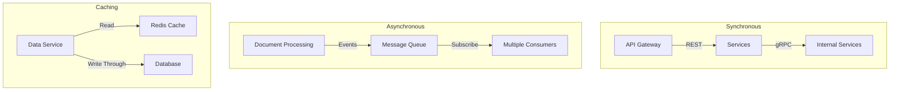

## 4.4 Cross-Cutting Concerns

### 4.4.1 Monitoring and Observability

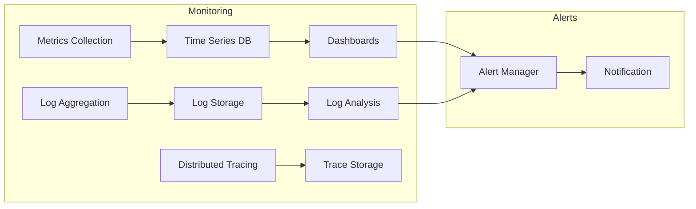

### 4.4.2 Security Architecture

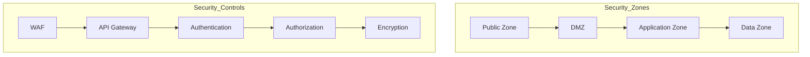

## 4.5 Deployment Architecture

```mermaid
C4Deployment
    title Deployment Diagram

    Deployment_Node(cdn, "CDN", "CloudFront") {
        Container(static, "Static Assets")
    }
    
    Deployment_Node(az1, "Availability Zone 1") {
        Deployment_Node(k8s1, "Kubernetes Cluster") {
            Container(svcs1, "Application Services")
        }
        Deployment_Node(db1, "Database Primary") {
            ContainerDb(pg1, "PostgreSQL")
        }
    }
    
    Deployment_Node(az2, "Availability Zone 2") {
        Deployment_Node(k8s2, "Kubernetes Cluster") {
            Container(svcs2, "Application Services")
        }
        Deployment_Node(db2, "Database Replica") {
            ContainerDb(pg2, "PostgreSQL")
        }
    }
    
    Rel(cdn, k8s1, "Routes traffic")
    Rel(cdn, k8s2, "Routes traffic")
    Rel(pg1, pg2, "Replication")
```

# 5. SYSTEM DESIGN

## 5.1 USER INTERFACE DESIGN

### 5.1.1 Design Specifications

| Category | Requirements |
|----------|--------------|
| Visual Hierarchy | - Card-based layout for applications<br>- Status-driven color coding<br>- Progressive disclosure for complex forms<br>- Consistent spacing system (8px grid) |
| Component Library | - Material Design components<br>- Custom MCA-specific components<br>- Reusable form elements<br>- Standardized data tables |
| Responsive Design | - Breakpoints: 320px, 768px, 1024px, 1440px<br>- Mobile-first approach<br>- Fluid typography (16px base) |
| Accessibility | - WCAG 2.1 Level AA compliance<br>- ARIA labels for dynamic content<br>- Keyboard navigation support<br>- Screen reader optimization |
| Browser Support | - Chrome (last 2 versions)<br>- Firefox (last 2 versions)<br>- Safari (last 2 versions)<br>- Edge (last 2 versions) |
| Theme Support | - Light/Dark mode toggle<br>- High contrast mode<br>- System preference detection |

### 5.1.2 Interface Elements

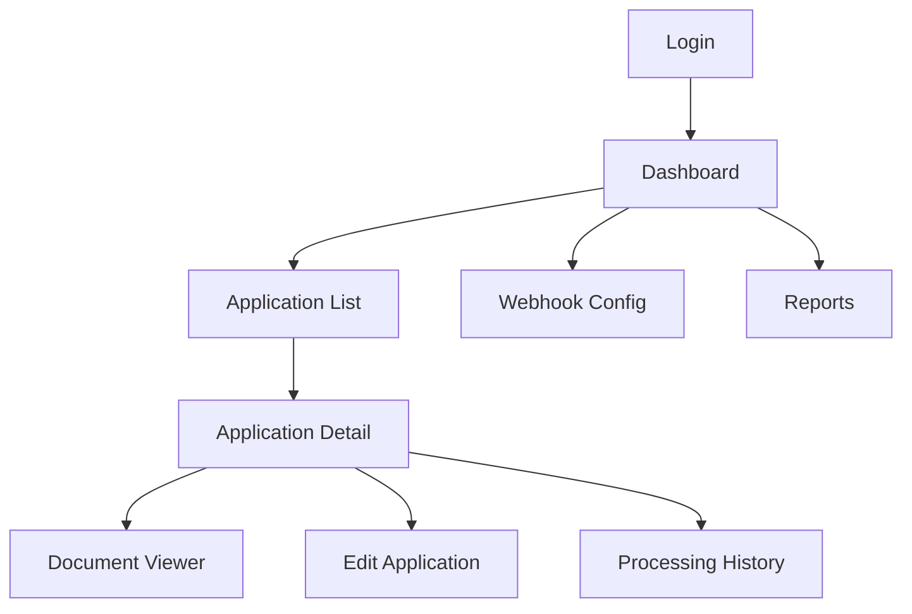

#### Critical User Flows

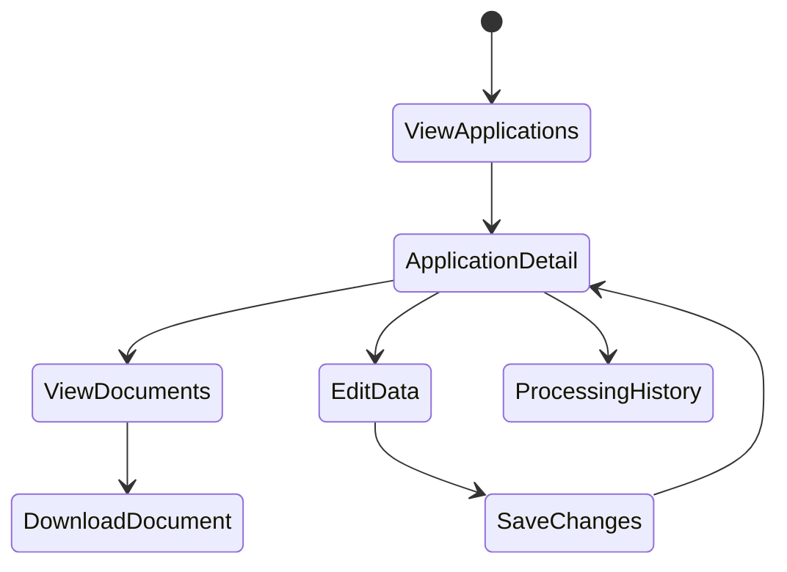

#### Form Validation Rules

| Field Type | Validation Rules |
|------------|-----------------|
| Business Name | Required, 2-100 characters |
| EIN | Required, 9 digits, checksum validation |
| SSN | Required, 9 digits, format XXX-XX-XXXX |
| Email | Required, RFC 5322 compliance |
| Phone | Required, E.164 format |
| Currency | Required, 2 decimal places, positive |
| Dates | Required, ISO 8601 format |

## 5.2 DATABASE DESIGN

### 5.2.1 Schema Design

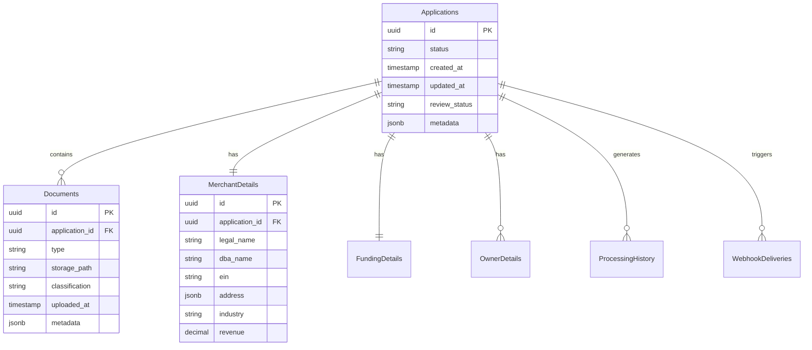

### 5.2.2 Data Management

| Aspect | Strategy |
|--------|----------|
| Migrations | - Flyway for version control<br>- Forward-only migrations<br>- Automated testing of migrations |
| Versioning | - Semantic versioning for schema<br>- Change tracking in audit tables |
| Archival | - Automated archival after 2 years<br>- Compressed cold storage<br>- Queryable archive tables |
| Retention | - 7-year retention for all data<br>- Compliance with financial regulations |
| Privacy | - Field-level encryption for PII<br>- Data masking for non-prod environments |

### 5.2.3 Performance Optimization

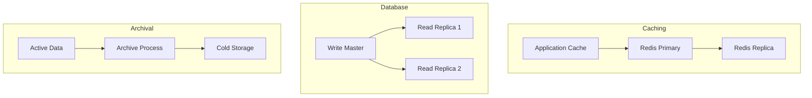

## 5.3 API DESIGN

### 5.3.1 API Architecture

| Component | Specification |
|-----------|--------------|
| Protocol | REST over HTTPS |
| Authentication | JWT with OAuth 2.0 |
| Rate Limiting | - 1000 requests/hour per client<br>- Burst: 50 requests/minute |
| Versioning | URI-based (/v1/, /v2/) |
| Documentation | OpenAPI 3.0 Specification |

### 5.3.2 Interface Specifications

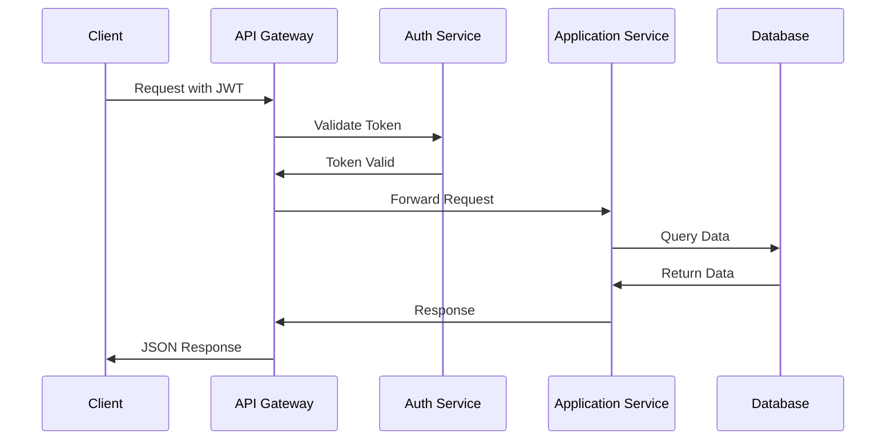

#### Endpoint Structure

| Endpoint | Method | Purpose |
|----------|--------|---------|
| /v1/applications | GET | List applications |
| /v1/applications/{id} | GET | Get application details |
| /v1/applications/{id}/documents | GET | List application documents |
| /v1/webhooks | POST | Register webhook |
| /v1/webhooks/{id} | DELETE | Remove webhook |

#### Response Formats

```json
{
  "data": {
    "id": "uuid",
    "type": "application",
    "attributes": {},
    "relationships": {}
  },
  "meta": {
    "timestamp": "ISO8601",
    "version": "1.0"
  }
}
```

### 5.3.3 Integration Requirements

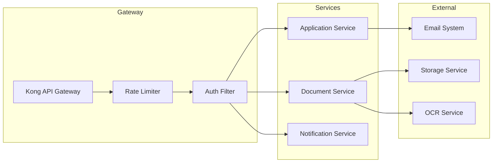

# 6. TECHNOLOGY STACK

## 6.1 PROGRAMMING LANGUAGES

| Platform/Component | Language & Version | Justification |
|-------------------|-------------------|----------------|
| Email Service | Node.js v18 LTS | - Excellent async I/O for email processing<br>- Rich ecosystem for email handling<br>- Native support for event-driven architecture |
| Document Processing | Python 3.11 | - Extensive ML/AI libraries for OCR<br>- Strong image processing capabilities<br>- Mature PDF handling libraries |
| Core Business Logic | Java 17 LTS | - Enterprise-grade stability<br>- Strong type safety<br>- Excellent database integration |
| Web Frontend | TypeScript 5.0 | - Type safety for large-scale applications<br>- Enhanced developer productivity<br>- Better maintainability |
| Infrastructure Scripts | Go 1.20 | - Fast execution for infrastructure tasks<br>- Excellent cloud SDK support<br>- Single binary deployment |

## 6.2 FRAMEWORKS & LIBRARIES

### 6.2.1 Backend Frameworks

| Component | Framework | Version | Justification |
|-----------|-----------|---------|---------------|
| Email Service | NestJS | 10.x | - Enterprise-ready Node.js framework<br>- Strong TypeScript support<br>- Built-in dependency injection |
| Document Processing | FastAPI | 0.100.x | - High performance async support<br>- Automatic OpenAPI documentation<br>- Native Python type hints |
| Core Services | Spring Boot | 3.1.x | - Industry standard for Java enterprise<br>- Comprehensive ecosystem<br>- Built-in security features |

### 6.2.2 Frontend Frameworks

| Component | Framework | Version | Justification |
|-----------|-----------|---------|---------------|
| Web Application | React | 18.x | - Robust component model<br>- Large ecosystem<br>- Strong TypeScript support |
| UI Components | Material-UI | 5.x | - Enterprise-ready components<br>- Accessibility support<br>- Consistent design system |
| State Management | Redux Toolkit | 1.9.x | - Predictable state management<br>- Built-in TypeScript support<br>- Developer tools integration |

## 6.3 DATABASES & STORAGE

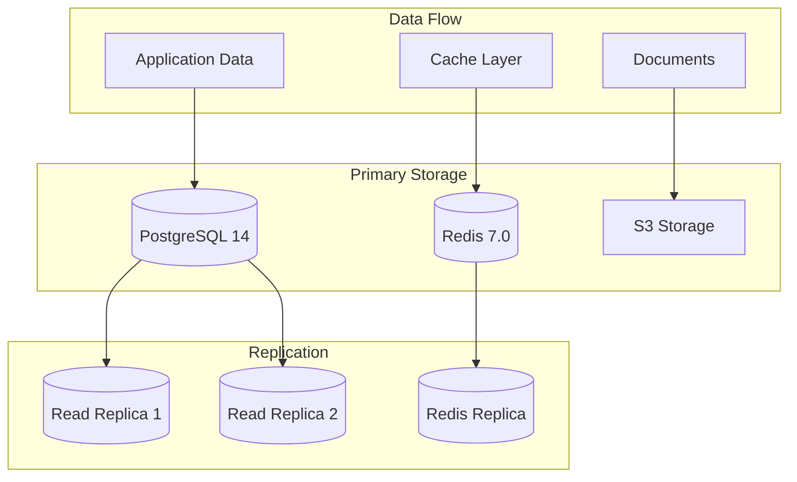

### 6.3.1 Database Solutions

| Type | Technology | Version | Purpose |
|------|------------|---------|----------|
| Primary Database | PostgreSQL | 14.x | - Application data<br>- Transactional operations<br>- Audit logs |
| Cache Layer | Redis | 7.0.x | - Session management<br>- API response caching<br>- Rate limiting |
| Document Storage | S3 | N/A | - PDF storage<br>- Document versioning<br>- Secure access |

## 6.4 THIRD-PARTY SERVICES

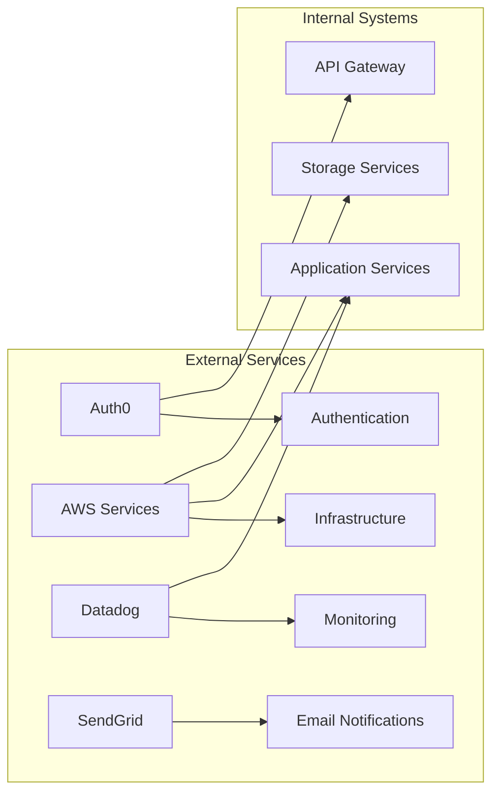

| Service | Purpose | Integration Method |
|---------|---------|-------------------|
| Auth0 | Authentication & Authorization | OAuth 2.0/OIDC |
| AWS Services | Cloud Infrastructure | AWS SDK |
| Datadog | Monitoring & APM | Agent-based |
| SendGrid | Transactional Emails | REST API |
| Tesseract OCR | Document Processing | Native Integration |

## 6.5 DEVELOPMENT & DEPLOYMENT

### 6.5.1 Development Tools

| Category | Tool | Version | Purpose |
|----------|------|---------|----------|
| IDE | IntelliJ IDEA | 2023.2 | Java/TypeScript development |
| Code Quality | SonarQube | 9.x | Static code analysis |
| API Testing | Postman | Latest | API development & testing |
| Version Control | Git | 2.40+ | Source code management |

### 6.5.2 CI/CD Pipeline

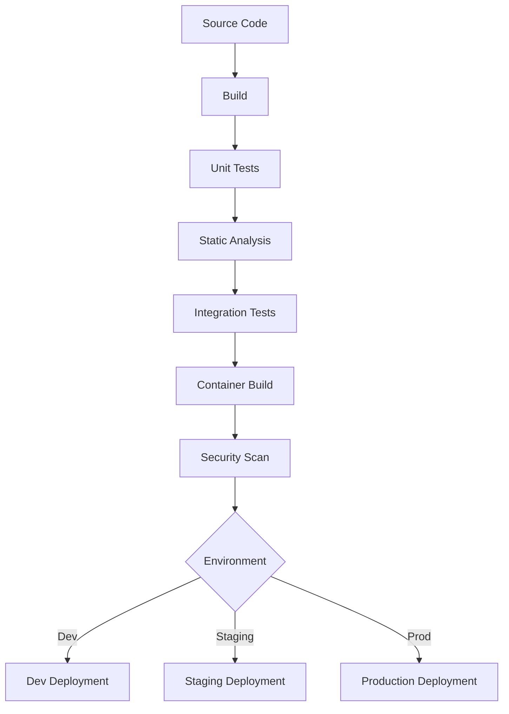

### 6.5.3 Infrastructure

| Component | Technology | Version | Purpose |
|-----------|------------|---------|----------|
| Containers | Docker | 24.x | Application packaging |
| Orchestration | Kubernetes | 1.27.x | Container orchestration |
| Service Mesh | Istio | 1.18.x | Microservices networking |
| IaC | Terraform | 1.5.x | Infrastructure provisioning |
| Secrets | HashiCorp Vault | 1.13.x | Secrets management |

### 6.5.4 Monitoring Stack

| Component | Tool | Purpose |
|-----------|------|---------|
| Metrics | Prometheus | Time-series metrics |
| Logging | ELK Stack | Log aggregation |
| Tracing | Jaeger | Distributed tracing |
| Alerting | PagerDuty | Incident management |
| Dashboards | Grafana | Metrics visualization |

Based on the background information and previous sections, I'll generate the SYSTEM DESIGN section focusing on UI, Database, and API design since all are applicable for this MCA application processing system.

# 5. SYSTEM DESIGN

## 5.1 USER INTERFACE DESIGN

### 5.1.1 Design Specifications

| Category | Requirements |
|----------|--------------|
| Visual Hierarchy | - Card-based layout for applications<br>- Status-driven color coding<br>- Progressive disclosure for complex forms<br>- Consistent spacing system (8px grid) |
| Component Library | - Material Design components<br>- Custom MCA-specific components<br>- Reusable form elements<br>- Standardized data tables |
| Responsive Design | - Breakpoints: 320px, 768px, 1024px, 1440px<br>- Mobile-first approach<br>- Fluid typography (16px base) |
| Accessibility | - WCAG 2.1 Level AA compliance<br>- ARIA labels for dynamic content<br>- Keyboard navigation support<br>- Screen reader optimization |
| Browser Support | - Chrome (last 2 versions)<br>- Firefox (last 2 versions)<br>- Safari (last 2 versions)<br>- Edge (last 2 versions) |
| Theme Support | - Light/Dark mode toggle<br>- High contrast mode<br>- System preference detection |

### 5.1.2 Interface Elements


#### Critical User Flows


#### Form Validation Rules

| Field Type | Validation Rules |
|------------|-----------------|
| Business Name | Required, 2-100 characters |
| EIN | Required, 9 digits, checksum validation |
| SSN | Required, 9 digits, format XXX-XX-XXXX |
| Email | Required, RFC 5322 compliance |
| Phone | Required, E.164 format |
| Currency | Required, 2 decimal places, positive |
| Dates | Required, ISO 8601 format |

## 5.2 DATABASE DESIGN

### 5.2.1 Schema Design


### 5.2.2 Data Management

| Aspect | Strategy |
|--------|----------|
| Migrations | - Flyway for version control<br>- Forward-only migrations<br>- Automated testing of migrations |
| Versioning | - Semantic versioning for schema<br>- Change tracking in audit tables |
| Archival | - Automated archival after 2 years<br>- Compressed cold storage<br>- Queryable archive tables |
| Retention | - 7-year retention for all data<br>- Compliance with financial regulations |
| Privacy | - Field-level encryption for PII<br>- Data masking for non-prod environments |

### 5.2.3 Performance Optimization


## 5.3 API DESIGN

### 5.3.1 API Architecture

| Component | Specification |
|-----------|--------------|
| Protocol | REST over HTTPS |
| Authentication | JWT with OAuth 2.0 |
| Rate Limiting | - 1000 requests/hour per client<br>- Burst: 50 requests/minute |
| Versioning | URI-based (/v1/, /v2/) |
| Documentation | OpenAPI 3.0 Specification |

### 5.3.2 Interface Specifications


#### Endpoint Structure

| Endpoint | Method | Purpose |
|----------|--------|---------|
| /v1/applications | GET | List applications |
| /v1/applications/{id} | GET | Get application details |
| /v1/applications/{id}/documents | GET | List application documents |
| /v1/webhooks | POST | Register webhook |
| /v1/webhooks/{id} | DELETE | Remove webhook |

#### Response Formats

```json
{
  "data": {
    "id": "uuid",
    "type": "application",
    "attributes": {},
    "relationships": {}
  },
  "meta": {
    "timestamp": "ISO8601",
    "version": "1.0"
  }
}
```

### 5.3.3 Integration Requirements

```mermaid
flowchart LR
    subgraph Gateway
        A[Kong API Gateway]
        B[Rate Limiter]
        C[Auth Filter]
    end
    
    subgraph Services
        D[Application Service]
        E[Document Service]
        F[Notification Service]
    end
    
    subgraph External
        G[Email System]
        H[Storage Service]
        I[OCR Service]
    end
    
    A --> B
    B --> C
    C --> D
    C --> E
    C --> F
    
    D --> G
    E --> H
    E --> I
```

Based on the requirements, I'll create a detailed USER INTERFACE DESIGN section that aligns with the Material Design components and React framework specified in the technology stack.

# 5.1 USER INTERFACE DESIGN

## 5.1.1 Common Elements Key

```
Symbol Key:
[#] - Dashboard/Menu icon    [@] - User profile      [=] - Settings
[?] - Help/Documentation    [!] - Alert/Warning      [x] - Close/Remove
[+] - Add/Create new        [$] - Financial data     [i] - Information
[^] - Upload document       [<] [>] - Navigation     [*] - Important/Featured
[v] - Dropdown menu        [...] - Text input        [ ] - Checkbox
(•) - Selected radio       ( ) - Unselected radio   [Button] - Action button
```

## 5.1.2 Main Dashboard

```
+----------------------------------------------------------+
|  [#] Dollar Funding MCA Portal           [@] Admin [=]    |
+----------------------------------------------------------+
|                                                          |
|  Applications Overview                     [+ New Alert] |
|  +---------------------------------------------------+ |
|  |  Pending Review     In Process      Completed      | |
|  |  [!] 24            [====] 13        [*] 158       | |
|  +---------------------------------------------------+ |
|                                                        |
|  Recent Applications                    [+ Add Filter] |
|  +---------------------------------------------------+ |
|  | Status | Business    | Amount   | Received  | Action|
|  |--------|------------|----------|-----------|--------|
|  | [!]    | ABC Corp   | $50,000  | 1hr ago  |[View] |
|  | [====] | XYZ LLC    | $75,000  | 2hr ago  |[View] |
|  | [*]    | 123 Inc    | $25,000  | 3hr ago  |[View] |
|  +---------------------------------------------------+ |
|                                     [< 1 2 3 ... 10 >] |
|                                                        |
|  Quick Actions                                         |
|  +------------------+  +------------------+            |
|  | [^] Upload App   |  | [$] Review Apps  |            |
|  +------------------+  +------------------+            |
+----------------------------------------------------------+
```

## 5.1.3 Application Detail View

```
+----------------------------------------------------------+
|  [<] Back to Dashboard    Application #A12345             |
+----------------------------------------------------------+
|                                                          |
|  Status: [! Review Required]                             |
|  +---------------------------------------------------+ |
|  | Document Preview                | Application Data  | |
|  | +---------------------+        |                   | |
|  | |                     |        | Business Details  | |
|  | |   PDF Viewer        |        | [...............] | |
|  | |                     |        | EIN: [x] Invalid  | |
|  | |   [< Page 1/3 >]    |        |                   | |
|  | +---------------------+        | Owner Details     | |
|  |                               | [...............] | |
|  | Documents:                     | SSN: [!] Missing  | |
|  | [ ] ISO Application           |                   | |
|  | [ ] Bank Statements           | Funding Request   | |
|  | [ ] Voided Check             | [$] 75,000        | |
|  +---------------------------------------------------+ |
|                                                        |
|  [Save Changes]  [Request Review]  [Approve]  [Reject] |
+----------------------------------------------------------+
```

## 5.1.4 Webhook Configuration

```
+----------------------------------------------------------+
|  [=] Webhook Management                                   |
+----------------------------------------------------------+
|                                                          |
|  Active Webhooks                        [+ Add Webhook]  |
|  +---------------------------------------------------+ |
|  | URL                  | Events        | Status      | |
|  |----------------------|---------------|-------------| |
|  | https://api.ex...    | [v] All      | [====] OK   | |
|  | https://notify...    | [v] Review   | [!] Failed  | |
|  +---------------------------------------------------+ |
|                                                        |
|  Add New Webhook                                       |
|  +---------------------------------------------------+ |
|  | Endpoint URL:                                       | |
|  | [...................................................] |
|  |                                                     | |
|  | Events:                                            | |
|  | [ ] Application Received                           | |
|  | [ ] Review Required                               | |
|  | [ ] Processing Complete                           | |
|  |                                                     | |
|  | [Test Webhook]  [Save Configuration]               | |
|  +---------------------------------------------------+ |
+----------------------------------------------------------+
```

## 5.1.5 Document Viewer

```
+----------------------------------------------------------+
|  Document Viewer - ISO Application                        |
+----------------------------------------------------------+
|  +---------------------------------------------------+ |
|  |                                                     | |
|  |  +----------------+  +-------------------------+    | |
|  |  | Tools         |  |                         |    | |
|  |  | [+] Zoom In   |  |                         |    | |
|  |  | [-] Zoom Out  |  |     PDF Document        |    | |
|  |  | [^] Download  |  |                         |    | |
|  |  | [?] Help      |  |                         |    | |
|  |  +----------------+  |                         |    | |
|  |                     |                         |    | |
|  |  Page: [v]         |                         |    | |
|  |  1 of 3            |                         |    | |
|  |                     |                         |    | |
|  |  [< Prev] [Next >]  |                         |    | |
|  |                     +-------------------------+    | |
|  |                                                     | |
|  +---------------------------------------------------+ |
|                                                        |
|  [Extract Data]  [Save Notes]  [Mark as Reviewed]      |
+----------------------------------------------------------+
```

## 5.1.6 Mobile Responsive Adaptations

```
+----------------------+
| [#] MCA Portal  [=] |
+----------------------+
| Applications      [v]|
|                     |
| Quick Stats         |
| +------------------+|
| |Pending: 24      ||
| |Process: 13      ||
| |Complete: 158    ||
| +------------------+|
|                     |
| Recent             |
| +------------------+|
| |[!] ABC Corp     ||
| |$50,000         ||
| |1hr ago [View]  ||
| +------------------+|
| |[====] XYZ LLC   ||
| |$75,000         ||
| |2hr ago [View]  ||
| +------------------+|
|                     |
| [+ New Application] |
+----------------------+
```

## 5.1.7 Navigation Structure

```mermaid
flowchart TD
    A[Login] --> B[Dashboard]
    B --> C[Application List]
    B --> D[Webhook Config]
    B --> E[Settings]
    B --> F[Profile]
    
    C --> G[Application Detail]
    G --> H[Document Viewer]
    G --> I[Edit Application]
    G --> J[Processing History]
    
    D --> K[Add Webhook]
    D --> L[Test Webhook]
    D --> M[Webhook Logs]
```

# 7. SECURITY CONSIDERATIONS

## 7.1 AUTHENTICATION AND AUTHORIZATION

### 7.1.1 Authentication Methods

| Method | Use Case | Implementation |
|--------|----------|----------------|
| JWT Bearer Tokens | API Access | - Auth0 integration<br>- 1-hour token expiry<br>- Refresh token rotation |
| OAuth 2.0 | Third-party Integration | - Authorization code flow<br>- PKCE extension<br>- Scope-based access |
| Session-based | Web UI Access | - Redis session store<br>- 24-hour session lifetime<br>- Secure cookie flags |
| API Keys | Webhook Configuration | - SHA-256 hashed storage<br>- Automatic rotation every 90 days<br>- Rate limiting per key |

### 7.1.2 Authorization Model

```mermaid
flowchart TD
    A[User Authentication] --> B{Role Check}
    B -->|Admin| C[Full Access]
    B -->|Operations| D[Limited Access]
    B -->|API| E[Endpoint Access]
    
    C --> F[User Management]
    C --> G[System Config]
    C --> H[All Data Access]
    
    D --> I[Application View]
    D --> J[Document Access]
    D --> K[Limited Edit]
    
    E --> L[API Resources]
    E --> M[Webhook Config]
```

### 7.1.3 Role-Based Access Control (RBAC)

| Role | Permissions | Access Level |
|------|------------|--------------|
| System Admin | - User management<br>- System configuration<br>- Security settings<br>- All data access | Full |
| Operations Manager | - Application review<br>- Document management<br>- Report generation<br>- Webhook configuration | Read/Write |
| Operations Staff | - Application viewing<br>- Document viewing<br>- Basic data entry | Read/Limited Write |
| API Client | - Endpoint access<br>- Webhook management<br>- Document retrieval | API-Specific |

## 7.2 DATA SECURITY

### 7.2.1 Encryption Standards

| Data Type | Encryption Method | Key Management |
|-----------|------------------|----------------|
| PII (SSN, DOB) | AES-256 Field-level | - AWS KMS managed keys<br>- 30-day rotation<br>- Separate key per environment |
| Documents | AES-256 at rest | - S3 server-side encryption<br>- Unique key per object<br>- Versioning enabled |
| Database | TDE with AES-256 | - Hardware security module<br>- Automated backup encryption<br>- Key rotation schedule |
| Communications | TLS 1.3 | - Modern cipher suites only<br>- Perfect forward secrecy<br>- Certificate pinning |

### 7.2.2 Data Protection Flow

```mermaid
flowchart TD
    subgraph Input
        A[Client Request] -->|TLS 1.3| B[API Gateway]
    end
    
    subgraph Processing
        B -->|JWT Validation| C[Application Layer]
        C -->|Field Encryption| D[Data Layer]
    end
    
    subgraph Storage
        D -->|TDE| E[(Encrypted Database)]
        D -->|SSE| F[Encrypted Objects]
    end
    
    subgraph Keys
        G[KMS] -->|Key Access| D
        G -->|Key Access| E
        G -->|Key Access| F
    end
```

## 7.3 SECURITY PROTOCOLS

### 7.3.1 Network Security

```mermaid
flowchart TD
    subgraph External
        A[Internet] -->|TLS| B[WAF]
    end
    
    subgraph DMZ
        B -->|Filter| C[Load Balancer]
        C -->|Route| D[API Gateway]
    end
    
    subgraph Private
        D -->|Internal| E[Services]
        E -->|Encrypted| F[(Data Store)]
    end
```

### 7.3.2 Security Controls

| Control Type | Implementation | Monitoring |
|--------------|----------------|------------|
| WAF | - AWS WAF<br>- OWASP rule set<br>- Custom rules for MCA patterns | - Real-time alerts<br>- Attack pattern detection<br>- Automatic blocking |
| DDoS Protection | - CloudFront shield<br>- Rate limiting<br>- Traffic filtering | - Bandwidth monitoring<br>- Request pattern analysis<br>- Automatic mitigation |
| Vulnerability Management | - Weekly automated scans<br>- Quarterly penetration testing<br>- Dependency analysis | - SAST/DAST integration<br>- Compliance reporting<br>- Risk assessment |

### 7.3.3 Security Monitoring

| Component | Monitoring Method | Alert Threshold |
|-----------|------------------|-----------------|
| Authentication | - Failed login attempts<br>- Token validation failures<br>- Session anomalies | - 5 failures/minute<br>- 50 failures/hour<br>- Geo-location changes |
| API Security | - Rate limit breaches<br>- Invalid tokens<br>- Suspicious patterns | - 100 requests/minute<br>- 3 invalid tokens/minute<br>- Pattern deviation |
| Data Access | - Unauthorized attempts<br>- Bulk data access<br>- After-hours activity | - Any unauthorized access<br>- >100 records/minute<br>- Outside business hours |

### 7.3.4 Incident Response

```mermaid
stateDiagram-v2
    [*] --> Detection
    Detection --> Analysis
    Analysis --> Containment
    Containment --> Eradication
    Eradication --> Recovery
    Recovery --> PostIncident
    PostIncident --> [*]
    
    Analysis --> Escalation
    Escalation --> Containment
```

### 7.3.5 Compliance Protocols

| Requirement | Implementation | Validation |
|-------------|----------------|------------|
| SOC 2 Type II | - Access controls<br>- Encryption standards<br>- Audit logging | Quarterly audit |
| PCI DSS | - Data isolation<br>- Key management<br>- Network segmentation | Annual certification |
| GDPR | - Data minimization<br>- Privacy controls<br>- Right to erasure | Continuous monitoring |
| State Privacy Laws | - Data handling policies<br>- Consent management<br>- Breach notification | Regular assessment |

# 8. INFRASTRUCTURE

## 8.1 DEPLOYMENT ENVIRONMENT

| Environment | Purpose | Configuration |
|-------------|---------|---------------|
| Development | Feature development and testing | - Single region<br>- Reduced redundancy<br>- Sandbox integrations |
| Staging | Pre-production validation | - Multi-AZ deployment<br>- Production-like setup<br>- Test data only |
| Production | Live system operation | - Multi-region active-active<br>- Full redundancy<br>- High availability |

### 8.1.1 Production Architecture

```mermaid
flowchart TD
    subgraph Region1[US-East]
        LB1[Load Balancer] --> AZ1[AZ-1a]
        LB1 --> AZ2[AZ-1b]
        
        subgraph AZ1
            K8S1[K8S Cluster]
            DB1[(Primary DB)]
            Cache1[(Redis Primary)]
        end
        
        subgraph AZ2
            K8S2[K8S Cluster]
            DB2[(DB Replica)]
            Cache2[(Redis Replica)]
        end
    end
    
    subgraph Region2[US-West]
        LB2[Load Balancer] --> AZ3[AZ-2a]
        LB2 --> AZ4[AZ-2b]
        
        subgraph AZ3
            K8S3[K8S Cluster]
            DB3[(DR DB)]
            Cache3[(Redis DR)]
        end
        
        subgraph AZ4
            K8S4[K8S Cluster]
            DB4[(DB Replica)]
            Cache4[(Redis Replica)]
        end
    end
    
    CDN[CloudFront] --> LB1
    CDN --> LB2
```

## 8.2 CLOUD SERVICES

| Service Category | AWS Service | Purpose | Configuration |
|-----------------|-------------|----------|---------------|
| Compute | EKS | Kubernetes orchestration | - v1.27<br>- m6i.2xlarge nodes<br>- Auto-scaling groups |
| Database | Aurora PostgreSQL | Primary database | - Multi-AZ deployment<br>- 14.x version<br>- r6g.2xlarge instances |
| Caching | ElastiCache | Redis caching | - Cluster mode enabled<br>- r6g.xlarge nodes<br>- Multi-AZ replication |
| Storage | S3 | Document storage | - Standard storage class<br>- Versioning enabled<br>- Cross-region replication |
| CDN | CloudFront | Content delivery | - Custom domain<br>- SSL/TLS<br>- Edge locations worldwide |
| DNS | Route 53 | DNS management | - Health checks<br>- Latency-based routing<br>- Failover configuration |
| Security | KMS | Encryption key management | - Automatic rotation<br>- Multi-region keys<br>- CMK for sensitive data |
| Monitoring | CloudWatch | System monitoring | - Custom metrics<br>- Log aggregation<br>- Alerting integration |

## 8.3 CONTAINERIZATION

### 8.3.1 Container Strategy

```mermaid
flowchart LR
    subgraph Base Images
        A[Node 18 Alpine] --> B[Email Service]
        C[Python 3.11 Slim] --> D[Document Service]
        E[OpenJDK 17 Slim] --> F[Core Services]
        G[NGINX Alpine] --> H[Web Frontend]
    end
    
    subgraph Security
        I[Vulnerability Scan]
        J[Image Signing]
        K[SBOM Generation]
    end
    
    B & D & F & H --> I --> J --> K
```

### 8.3.2 Container Specifications

| Service | Base Image | Resource Limits | Health Checks |
|---------|------------|-----------------|---------------|
| Email Service | node:18-alpine | CPU: 1 core<br>Memory: 2GB | HTTP /health<br>30s interval |
| Document Service | python:3.11-slim | CPU: 2 cores<br>Memory: 4GB | HTTP /health<br>20s interval |
| Core Services | openjdk:17-slim | CPU: 2 cores<br>Memory: 4GB | HTTP /actuator/health<br>15s interval |
| Web Frontend | nginx:alpine | CPU: 0.5 core<br>Memory: 1GB | HTTP /health<br>60s interval |

## 8.4 ORCHESTRATION

### 8.4.1 Kubernetes Architecture

```mermaid
flowchart TD
    subgraph Cluster
        A[Ingress Controller] --> B[Service Mesh]
        
        subgraph Workloads
            B --> C[Application Pods]
            B --> D[Background Jobs]
            B --> E[Scheduled Tasks]
        end
        
        subgraph Storage
            F[(Persistent Volumes)]
            G[(ConfigMaps)]
            H[(Secrets)]
        end
        
        C & D & E --> F & G & H
    end
```

### 8.4.2 Kubernetes Components

| Component | Configuration | Purpose |
|-----------|--------------|----------|
| Ingress | NGINX Ingress Controller | - TLS termination<br>- Path-based routing<br>- Rate limiting |
| Service Mesh | Istio | - Service discovery<br>- Traffic management<br>- Security policies |
| Monitoring | Prometheus + Grafana | - Metrics collection<br>- Visualization<br>- Alerting |
| Scaling | HPA + VPA | - CPU/Memory based<br>- Custom metrics<br>- Pod autoscaling |

## 8.5 CI/CD PIPELINE

### 8.5.1 Pipeline Architecture

```mermaid
flowchart LR
    subgraph Source
        A[Git Repository] --> B[Branch Protection]
    end
    
    subgraph Build
        B --> C[Code Analysis]
        C --> D[Unit Tests]
        D --> E[Build Container]
        E --> F[Security Scan]
    end
    
    subgraph Deploy
        F --> G{Environment}
        G -->|Dev| H[Dev Cluster]
        G -->|Staging| I[Stage Cluster]
        G -->|Prod| J[Production]
    end
    
    subgraph Validation
        H & I & J --> K[Integration Tests]
        K --> L[Performance Tests]
        L --> M[Security Tests]
    end
```

### 8.5.2 Pipeline Stages

| Stage | Tools | Actions |
|-------|-------|---------|
| Source Control | GitHub Enterprise | - Feature branches<br>- Pull requests<br>- Code review |
| Build | Jenkins | - SonarQube analysis<br>- Unit testing<br>- Container builds |
| Security | Snyk + Aqua | - Dependency scanning<br>- Container scanning<br>- License compliance |
| Deployment | ArgoCD | - GitOps workflow<br>- Automated rollouts<br>- Rollback capability |
| Testing | JMeter + Selenium | - Integration tests<br>- Performance tests<br>- UI automation |
| Monitoring | Datadog | - Deployment tracking<br>- Performance metrics<br>- Error tracking |

### 8.5.3 Deployment Strategy

| Environment | Strategy | Validation |
|-------------|----------|------------|
| Development | Direct deployment | - Basic smoke tests<br>- Unit test coverage |
| Staging | Blue/Green | - Full integration suite<br>- Performance baseline |
| Production | Canary | - Progressive traffic shift<br>- Automated rollback<br>- SLA monitoring |

# APPENDICES

## A.1 GLOSSARY

| Term | Definition |
|------|------------|
| Merchant Cash Advance (MCA) | A type of business financing where a company sells its future receivables at a discount for immediate capital |
| ISO Application | Independent Sales Organization application form used to collect merchant and funding details |
| Webhook | A method of augmenting or altering the behavior of a web application with custom callbacks |
| Document Classification | The process of categorizing documents into predefined types based on their content |
| Field-level Encryption | Encryption of specific data fields while leaving other fields unencrypted |
| Data Masking | The process of hiding original data with modified content while maintaining data usability |
| Presigned URL | A URL that provides temporary access to private objects in cloud storage |
| Circuit Breaker | Design pattern that prevents cascading failures by monitoring and stopping repeated failed operations |
| Blue/Green Deployment | Deployment strategy using two identical environments to minimize downtime |
| Canary Deployment | Gradual rollout of changes to a small subset of users before full deployment |
| GitOps | Infrastructure as Code methodology using Git as single source of truth |
| Service Mesh | Infrastructure layer handling service-to-service communication in microservices |

## A.2 ACRONYMS

| Acronym | Expansion |
|---------|-----------|
| MCA | Merchant Cash Advance |
| ISO | Independent Sales Organization |
| DBA | Doing Business As |
| EIN | Employer Identification Number |
| SSN | Social Security Number |
| DOB | Date of Birth |
| OCR | Optical Character Recognition |
| API | Application Programming Interface |
| UI | User Interface |
| JWT | JSON Web Token |
| HMAC | Hash-based Message Authentication Code |
| RPO | Recovery Point Objective |
| RTO | Recovery Time Objective |
| MTBF | Mean Time Between Failures |
| MTTR | Mean Time To Recovery |
| IAM | Identity and Access Management |
| CDN | Content Delivery Network |
| RBAC | Role-Based Access Control |
| TDE | Transparent Data Encryption |
| WAF | Web Application Firewall |
| SAST | Static Application Security Testing |
| DAST | Dynamic Application Security Testing |
| SBOM | Software Bill of Materials |
| HPA | Horizontal Pod Autoscaler |
| VPA | Vertical Pod Autoscaler |

## A.3 TECHNICAL DEPENDENCIES

```mermaid
flowchart TD
    subgraph Infrastructure
        A[AWS Cloud Platform] --> B[EKS]
        A --> C[Aurora PostgreSQL]
        A --> D[ElastiCache]
        A --> E[S3]
    end
    
    subgraph Security
        F[Auth0] --> G[Authentication]
        H[KMS] --> I[Encryption]
        J[WAF] --> K[API Protection]
    end
    
    subgraph Monitoring
        L[Datadog] --> M[APM]
        L --> N[Logging]
        L --> O[Metrics]
    end
    
    subgraph Development
        P[GitHub Enterprise] --> Q[Source Control]
        R[Jenkins] --> S[CI/CD]
        T[ArgoCD] --> U[GitOps]
    end
```

## A.4 COMPLIANCE MATRIX

| Requirement | Implementation | Validation Method |
|-------------|---------------|-------------------|
| Data Encryption | AES-256 with KMS | Automated security scans |
| Access Control | RBAC with Auth0 | Access audit logs |
| Data Retention | 7-year policy with S3 lifecycle | Retention audit |
| Audit Logging | CloudWatch + Datadog | Log analysis |
| Disaster Recovery | Multi-region with auto-failover | DR testing |
| Data Privacy | Field-level encryption | Security assessment |
| Incident Response | PagerDuty integration | Incident drills |
| Change Management | GitOps workflow | Change audit logs |

## A.5 SYSTEM BOUNDARIES

```mermaid
flowchart LR
    subgraph External
        A[Brokers] --> B[Email System]
        C[Client Systems] --> D[API/UI]
    end
    
    subgraph Core System
        B --> E[Email Processing]
        E --> F[Document Processing]
        F --> G[Data Storage]
        G --> D
    end
    
    subgraph Support Systems
        H[Monitoring]
        I[Security]
        J[Backup]
    end
    
    E & F & G --> H
    E & F & G --> I
    G --> J
```

## A.6 ERROR CODES AND HANDLING

| Code Range | Category | Handling Strategy |
|------------|----------|-------------------|
| 1000-1999 | Email Processing | Retry with exponential backoff |
| 2000-2999 | Document Processing | Queue for manual review |
| 3000-3999 | Data Extraction | Partial processing with flags |
| 4000-4999 | API Errors | Client notification with details |
| 5000-5999 | System Errors | Automatic failover/recovery |
| 6000-6999 | Security Events | Alert and audit log creation |
| 7000-7999 | Integration Errors | Circuit breaker activation |